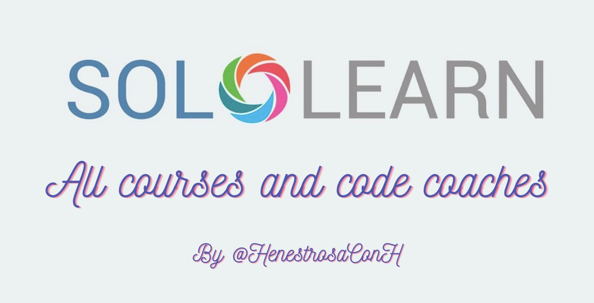

# SoloLearn

Compilation of all 29 SoloLearn courses with their respective projects and practices and all 72 code challenges for all 7 languages supported.

## Courses

	
C#

1. Basic concepts
	

		
Code practice

	- [C# is the best](https://github.com/HenestrosaConH/sololearn/tree/main/C%23/1.%20Basic%20concepts/Code%20practice/C%23%20is%20the%20best)	 
	- [How much do you earn](https://github.com/HenestrosaConH/sololearn/tree/main/C%23/1.%20Basic%20concepts/Code%20practice/How%20much%20do%20you%20earn)	
	- [Packing madness](https://github.com/HenestrosaConH/sololearn/tree/main/C%23/1.%20Basic%20concepts/Code%20practice/Packing%20madness)	
	- [Welcome message](https://github.com/HenestrosaConH/sololearn/tree/main/C%23/1.%20Basic%20concepts/Code%20practice/Welcome%20message)	
	- [Your first program](https://github.com/HenestrosaConH/sololearn/tree/main/C%23/1.%20Basic%20concepts/Code%20practice/Your%20first%20program)	
	

	

		
Code project

	- [Area of a circle](https://github.com/HenestrosaConH/sololearn/tree/main/C%23/1.%20Basic%20concepts/Code%20project)
	

2. Conditionals and loops
	

		
Code practice

	- [Difficulty levels](https://github.com/HenestrosaConH/sololearn/tree/main/C%23/2.%20Conditionals%20and%20loops/Code%20practice/Difficulty%20levels)	 
	- [Disney here we come](https://github.com/HenestrosaConH/sololearn/tree/main/C%23/2.%20Conditionals%20and%20loops/Code%20practice/Disney%20here%20we%20come)	
	- [Earning a scholarship](https://github.com/HenestrosaConH/sololearn/tree/main/C%23/2.%20Conditionals%20and%20loops/Code%20practice/Earning%20a%20scholarship)	
	- [Flight Kindles](https://github.com/HenestrosaConH/sololearn/tree/main/C%23/2.%20Conditionals%20and%20loops/Code%20practice/Flight%20Kindles)	
	- [Going once, going twice, sold](https://github.com/HenestrosaConH/sololearn/tree/main/C%23/2.%20Conditionals%20and%20loops/Code%20practice/Going%20once%2C%20going%20twice%2C%20sold)	
	- [Up we go](https://github.com/HenestrosaConH/sololearn/tree/main/C%23/2.%20Conditionals%20and%20loops/Code%20practice/Up%20we%20go)	
	

	

		
Code project

	- [Multiple of 3](https://github.com/HenestrosaConH/sololearn/tree/main/C%23/2.%20Conditionals%20and%20loops/Code%20project)
	

3. Methods
	

		
Code practice

	- [Fun with methods](https://github.com/HenestrosaConH/sololearn/tree/main/C%23/3.%20Methods/Code%20practice/Fun%20with%20methods)	 
	- [Geometry](https://github.com/HenestrosaConH/sololearn/tree/main/C%23/3.%20Methods/Code%20practice/Geometry)	
	- [Get that discount](https://github.com/HenestrosaConH/sololearn/tree/main/C%23/3.%20Methods/Code%20practice/Get%20that%20discount)	
	- [Getting a raise](https://github.com/HenestrosaConH/sololearn/tree/main/C%23/3.%20Methods/Code%20practice/Getting%20a%20raise)	
	- [Overloading](https://github.com/HenestrosaConH/sololearn/tree/main/C%23/3.%20Methods/Code%20practice/Overloading)	
	- [Recursive summing](https://github.com/HenestrosaConH/sololearn/tree/main/C%23/3.%20Methods/Code%20practice/Recursive%20summing)	
	- [Set it and forget it](https://github.com/HenestrosaConH/sololearn/tree/main/C%23/3.%20Methods/Code%20practice/Set%20it%20and%20forget%20it)	
	

	

		
Code project

	- [Level points](https://github.com/HenestrosaConH/sololearn/tree/main/C%23/3.%20Methods/Code%20project)
	

4. Classes and objects
	

		
Code practice

	- [Calculating wins](https://github.com/HenestrosaConH/sololearn/tree/main/C%23/4.%20Classes%20and%20objects/Code%20practice/Calculating%20wins)	 
	- [Card numbers](https://github.com/HenestrosaConH/sololearn/tree/main/C%23/4.%20Classes%20and%20objects/Code%20practice/Card%20numbers)	
	- [Creating a project](https://github.com/HenestrosaConH/sololearn/tree/main/C%23/4.%20Classes%20and%20objects/Code%20practice/Creating%20a%20project)	
	- [Welcome](https://github.com/HenestrosaConH/sololearn/tree/main/C%23/4.%20Classes%20and%20objects/Code%20practice/Welcome)	
	

	

		
Code project

	- [Social network](https://github.com/HenestrosaConH/sololearn/tree/main/C%23/4.%20Classes%20and%20objects/Code%20project)
	

5. Arrays and strings
	

		
Code practice

	- [Array to table](https://github.com/HenestrosaConH/sololearn/tree/main/C%23/5.%20Arrays%20and%20strings/Code%20practice/Array%20to%20table)	 
	- [Maximum and minimum](https://github.com/HenestrosaConH/sololearn/tree/main/C%23/5.%20Arrays%20and%20strings/Code%20practice/Maximum%20and%20minimum)	
	- [Only the evens](https://github.com/HenestrosaConH/sololearn/tree/main/C%23/5.%20Arrays%20and%20strings/Code%20practice/Only%20the%20evens)	
	- [Passwords rules](https://github.com/HenestrosaConH/sololearn/tree/main/C%23/5.%20Arrays%20and%20strings/Code%20practice/Passwords%20rules)	
	- [Qualifying for the Olympics](https://github.com/HenestrosaConH/sololearn/tree/main/C%23/5.%20Arrays%20and%20strings/Code%20practice/Qualifying%20for%20the%20Olympics)	
	- [Solve the puzzle](https://github.com/HenestrosaConH/sololearn/tree/main/C%23/5.%20Arrays%20and%20strings/Code%20practice/Solve%20the%20puzzle)	
	

	

		
Code project

	- [Words](https://github.com/HenestrosaConH/sololearn/tree/main/C%23/5.%20Arrays%20and%20strings/Code%20project)
	

6. More on classes
	

		
Code practice

	- [All about this](https://github.com/HenestrosaConH/sololearn/tree/main/C%23/6.%20More%20on%20classes/Code%20practice/All%20about%20this)	 
	- [Array sorting](https://github.com/HenestrosaConH/sololearn/tree/main/C%23/6.%20More%20on%20classes/Code%20practice/Array%20sorting)	
	- [Grow your business](https://github.com/HenestrosaConH/sololearn/tree/main/C%23/6.%20More%20on%20classes/Code%20practice/Grow%20your%20business)	
	- [Music selector](https://github.com/HenestrosaConH/sololearn/tree/main/C%23/6.%20More%20on%20classes/Code%20practice/Music%20selector)	
	- [Teamwork makes the dream](https://github.com/HenestrosaConH/sololearn/tree/main/C%23/6.%20More%20on%20classes/Code%20practice/Teamwork%20makes%20the%20dream)	
	- [Who won](https://github.com/HenestrosaConH/sololearn/tree/main/C%23/6.%20More%20on%20classes/Code%20practice/Who%20won)	
	

	

		
Code project

	- [Dance](https://github.com/HenestrosaConH/sololearn/tree/main/C%23/6.%20More%20on%20classes/Code%20project)
	

7. Inheritance and polymorphism
	

		
Code practice

	- [Attack](https://github.com/HenestrosaConH/sololearn/tree/main/C%23/7.%20Inheritance%20and%20polymorphism/Code%20practice/Attack)	 
	- [Make and model](https://github.com/HenestrosaConH/sololearn/tree/main/C%23/7.%20Inheritance%20and%20polymorphism/Code%20practice/Make%20and%20model)	
	- [Online car shopping](https://github.com/HenestrosaConH/sololearn/tree/main/C%23/7.%20Inheritance%20and%20polymorphism/Code%20practice/Online%20car%20shopping)	
	- [Perimeter calculator](https://github.com/HenestrosaConH/sololearn/tree/main/C%23/7.%20Inheritance%20and%20polymorphism/Code%20practice/Perimeter%20calculator)	
	- [Whats my account balance](https://github.com/HenestrosaConH/sololearn/tree/main/C%23/7.%20Inheritance%20and%20polymorphism/Code%20practice/Whats%20my%20account%20balance)	
	- [Where are the planes](https://github.com/HenestrosaConH/sololearn/tree/main/C%23/7.%20Inheritance%20and%20polymorphism/Code%20practice/Where%20are%20the%20planes)	
	

	

		
Code project

	- [Drawing application](https://github.com/HenestrosaConH/sololearn/tree/main/C%23/7.%20Inheritance%20and%20polymorphism/Code%20project)
	

8. Structs, enums, exceptions and files
	

		
Code practice

	- [Accelerate](https://github.com/HenestrosaConH/sololearn/tree/main/C%23/8.%20Structs%2C%20enums%2C%20exceptions%20and%20files/Code%20practice/Accelerate)	 
	- [Fun with dimensions](https://github.com/HenestrosaConH/sololearn/tree/main/C%23/8.%20Structs%2C%20enums%2C%20exceptions%20and%20files/Code%20practice/Fun%20with%20dimensions)	
	- [Going on vacation](https://github.com/HenestrosaConH/sololearn/tree/main/C%23/8.%20Structs%2C%20enums%2C%20exceptions%20and%20files/Code%20practice/Going%20on%20vacation)	
	

	

		
Code project

	- [Robot-barman](https://github.com/HenestrosaConH/sololearn/tree/main/C%23/8.%20Structs%2C%20enums%2C%20exceptions%20and%20files/Code%20project)
	

9. Generics
	

		
Code practice

	- [Generic all around](https://github.com/HenestrosaConH/sololearn/tree/main/C%23/9.%20Generics/Code%20practice/Generic%20all%20around)	 
	- [Hiring engineers](https://github.com/HenestrosaConH/sololearn/tree/main/C%23/9.%20Generics/Code%20practice/Hiring%20engineers)	
	- [Print to printer](https://github.com/HenestrosaConH/sololearn/tree/main/C%23/9.%20Generics/Code%20practice/Print%20to%20printer)	
	- [Queue it up](https://github.com/HenestrosaConH/sololearn/tree/main/C%23/9.%20Generics/Code%20practice/Queue%20it%20up)	
	- [Top of the leaderboard](https://github.com/HenestrosaConH/sololearn/tree/main/C%23/9.%20Generics/Code%20practice/Top%20of%20the%20leaderboard)	
	

	

		
Code project

	- [Coffee time](https://github.com/HenestrosaConH/sololearn/tree/main/C%23/9.%20Generics/Code%20project)
	

	
C++

1. Basic concepts
	- [Transportation](https://github.com/HenestrosaConH/sololearn/tree/main/C%2B%2B/1.%20Basic%20concepts/Code%20project/Transportation)
2. Conditionals and loops
	- [Countdown](https://github.com/HenestrosaConH/sololearn/tree/main/C%2B%2B/2.%20Conditionals%20and%20loops/Code%20project/Countdown)
3. Data types, arrays and pointers
	- [Ticket office](https://github.com/HenestrosaConH/sololearn/tree/main/C%2B%2B/3.%20Data%20types%2C%20arrays%20and%20pointers/Code%20project/Ticket%20office)
4. Functions
	- [Palindrome numbers](https://github.com/HenestrosaConH/sololearn/tree/main/C%2B%2B/4.%20Functions/Code%20project/Palindrome%20numbers)
5. Classes and objects
	- [Queue management part 1](https://github.com/HenestrosaConH/sololearn/tree/main/C%2B%2B/5.%20Classes%20and%20objects/Code%20coach/Queue%20management%20part%201)
6. More on classes
	- [Queue management part 2](https://github.com/HenestrosaConH/sololearn/tree/main/C%2B%2B/6.%20More%20on%20classes/Code%20project/Queue%20management%20part%202)
7. Inheritance and polymorphism
	- [Queue management part 3](https://github.com/HenestrosaConH/sololearn/tree/main/C%2B%2B/7.%20Inheritance%20and%20polymorphism/Code%20project/Queue%20management%20part%203)
8. Templates, exceptions and files
	- [Queue management part 4](https://github.com/HenestrosaConH/sololearn/tree/main/C%2B%2B/8.%20Templates%2C%20exceptions%20and%20files/Code%20project/Queue%20management%20part%204)

	
Data science

1. Data manipulation
	

		
Code project

	- [Water consumption](https://github.com/HenestrosaConH/sololearn/tree/main/Kotlin/1.%20Data%20manipulation/Code%20project)
	

2. Data analysis
	

		
Code project

	- [Ordinary squares](https://github.com/HenestrosaConH/sololearn/tree/main/Data%20science/2.%20Data%20analysis/Code%20project)
	

3. Data visualization
	

		
Code project

	- [Ordinary squares](https://github.com/HenestrosaConH/sololearn/tree/main/Data%20science/3.%20Data%20visualization/Code%20project)
	

4. Linear regression
	

		
Code project

	- [Ordinary squares](https://github.com/HenestrosaConH/sololearn/tree/main/Data%20science/4.%20Linear%20regression/Code%20project)
	

5. Classification
	

		
Code project

	- [Binary disorder](https://github.com/HenestrosaConH/sololearn/tree/main/Data%20science/5.%20Classification/Code%20project)
	

6. Clustering wines
	

		
Code project

	- [Pandas pandas pandas](https://github.com/HenestrosaConH/sololearn/tree/main/Data%20science/6.%20Clustering%20wines/Code%20project)
	

	
HTML

1. Overview
	

		
Code repo

	- [Creating your first HTML page (03.2 Code repo)](https://github.com/HenestrosaConH/sololearn/tree/main/HTML/1.%20Overview/03.2%20Code%20repo)	 
	

2. HTML Basics
	

		
Code repo

	- [Headings, lines, comments (06.2 Code repo)](https://github.com/HenestrosaConH/sololearn/tree/main/HTML/2.%20HTML%20Basics/06.2%20Code%20repo)	 
	- [Text formatting (08.2 Code repo)](https://github.com/HenestrosaConH/sololearn/tree/main/HTML/2.%20HTML%20Basics/08.2%20Code%20repo)	 
	- [Blog project: about me (09.2 Code repo)](https://github.com/HenestrosaConH/sololearn/tree/main/HTML/2.%20HTML%20Basics/09.2%20Code%20repo)	 
	- [Images (12.2 Code repo)](https://github.com/HenestrosaConH/sololearn/tree/main/HTML/2.%20HTML%20Basics/12.2%20Code%20repo)	 
	- [Lists (13.2 Code repo)](https://github.com/HenestrosaConH/sololearn/tree/main/HTML/2.%20HTML%20Basics/13.2%20Code%20repo)	 
	- [Tables (15.2 Code repo)](https://github.com/HenestrosaConH/sololearn/tree/main/HTML/2.%20HTML%20Basics/15.2%20Code%20repo)	 
	- [Links (16.2 Code repo)](https://github.com/HenestrosaConH/sololearn/tree/main/HTML/2.%20HTML%20Basics/16.2%20Code%20repo)	 
	- [Forms (19.2 Code repo)](https://github.com/HenestrosaConH/sololearn/tree/main/HTML/2.%20HTML%20Basics/19.2%20Code%20repo)	 
	- [Blog project: contact form (20.2 Code repo)](https://github.com/HenestrosaConH/sololearn/tree/main/HTML/2.%20HTML%20Basics/20.2%20Code%20repo)	 
	

3. Challenges  
	There are no code repos for this module
4. HTML5  
	There are no code repos for this module

	
Intermediate Python

1. Collection types
	

		
Code practice

	- [Car data](https://github.com/HenestrosaConH/sololearn/tree/main/Intermediate%20Python/1.%20Collection%20types/Code%20practice/Car%20data)	 
	- [Contact search](https://github.com/HenestrosaConH/sololearn/tree/main/Intermediate%20Python/1.%20Collection%20types/Code%20practice/Contact%20search)	 
	- [Ignore the vowels](https://github.com/HenestrosaConH/sololearn/tree/main/Intermediate%20Python/1.%20Collection%20types/Code%20practice/Ignore%20the%20vowels)	 
	- [Nation economic freedom](https://github.com/HenestrosaConH/sololearn/tree/main/Intermediate%20Python/1.%20Collection%20types/Code%20practice/Nation%20economic%20freedom)	 
	- [Square up](https://github.com/HenestrosaConH/sololearn/tree/main/Intermediate%20Python/1.%20Collection%20types/Code%20practice/Square%20up)	 
	- [You are qualified](https://github.com/HenestrosaConH/sololearn/tree/main/Intermediate%20Python/1.%20Collection%20types/Code%20practice/You%20are%20qualified)	 
	

	

		
Code project

	- [Letter count](https://github.com/HenestrosaConH/sololearn/tree/main/Intermediate%20Python/1.%20Collection%20types/Code%20project)
	

2. Functional programming
	

		
Code practice

	- [Collecting reports](https://github.com/HenestrosaConH/sololearn/tree/main/Intermediate%20Python/2.%20Functional%20programming/Code%20practice/Collecting%20reports)	 
	- [Decimal to binary](https://github.com/HenestrosaConH/sololearn/tree/main/Intermediate%20Python/2.%20Functional%20programming/Code%20practice/Decimal%20to%20binary)	 
	- [Generating](https://github.com/HenestrosaConH/sololearn/tree/main/Intermediate%20Python/2.%20Functional%20programming/Code%20practice/Generating)	 
	- [Getting a raise](https://github.com/HenestrosaConH/sololearn/tree/main/Intermediate%20Python/2.%20Functional%20programming/Code%20practice/Getting%20a%20raise)	 
	- [How much](https://github.com/HenestrosaConH/sololearn/tree/main/Intermediate%20Python/2.%20Functional%20programming/Code%20practice/How%20much)	 
	- [Making it work](https://github.com/HenestrosaConH/sololearn/tree/main/Intermediate%20Python/2.%20Functional%20programming/Code%20practice/Making%20it%20work)	 
	

	

		
Code project

	- [Spelling backwards](https://github.com/HenestrosaConH/sololearn/tree/main/Intermediate%20Python/2.%20Functional%20programming/Code%20project)
	

3. Object-oriented programming
	

		
Code practice

	- [Define the methods](https://github.com/HenestrosaConH/sololearn/tree/main/Intermediate%20Python/3.%20Object-oriented%20programming/Code%20practice/Define%20the%20methods)	 
	- [Fine art](https://github.com/HenestrosaConH/sololearn/tree/main/Intermediate%20Python/3.%20Object-oriented%20programming/Code%20practice/Fine%20art)	 
	- [Game over](https://github.com/HenestrosaConH/sololearn/tree/main/Intermediate%20Python/3.%20Object-oriented%20programming/Code%20practice/Game%20over)	 
	- [Preservation](https://github.com/HenestrosaConH/sololearn/tree/main/Intermediate%20Python/3.%20Object-oriented%20programming/Code%20practice/Preservation)	 
	- [Shape factory](https://github.com/HenestrosaConH/sololearn/tree/main/Intermediate%20Python/3.%20Object-oriented%20programming/Code%20practice/Shape%20factory)	 
	- [Staying alive](https://github.com/HenestrosaConH/sololearn/tree/main/Intermediate%20Python/3.%20Object-oriented%20programming/Code%20practice/Staying%20alive)	 
	

	

		
Code project

	- [Shooting game](https://github.com/HenestrosaConH/sololearn/tree/main/Intermediate%20Python/3.%20Object-oriented%20programming/Code%20project)
	

4. Exceptions
	

		
Code practice

	- [Cash out](https://github.com/HenestrosaConH/sololearn/tree/main/Intermediate%20Python/4.%20Exceptions/Code%20practice/Cash%20out)	 
	- [Chef's kiss](https://github.com/HenestrosaConH/sololearn/tree/main/Intermediate%20Python/4.%20Exceptions/Code%20practice/Chef's%20kiss)	 
	- [Say something](https://github.com/HenestrosaConH/sololearn/tree/main/Intermediate%20Python/4.%20Exceptions/Code%20practice/Say%20something)	 
	

	

		
Code project

	- [Registration system](https://github.com/HenestrosaConH/sololearn/tree/main/Intermediate%20Python/4.%20Exceptions/Code%20project)
	

5. Working with files
	

		
Code practice

	- [Book club](https://github.com/HenestrosaConH/sololearn/tree/main/Intermediate%20Python/5.%20Working%20with%20files/Code%20practice/Book%20club)	 
	- [Filling up with numbers](https://github.com/HenestrosaConH/sololearn/tree/main/Intermediate%20Python/5.%20Working%20with%20files/Code%20practice/Filling%20up%20with%20numbers)	 
	- [Reading through](https://github.com/HenestrosaConH/sololearn/tree/main/Intermediate%20Python/5.%20Working%20with%20files/Code%20practice/Reading%20through)	 
	

	

		
Code project

	- [Title encoder](https://github.com/HenestrosaConH/sololearn/tree/main/Intermediate%20Python/5.%20Working%20with%20files/Code%20project)
	

	
Java

1. Basic concepts
	

		
Code practice

	- [Once in the bar](https://github.com/HenestrosaConH/sololearn/tree/main/Java/1.%20Basic%20concepts/Code%20practice/Once%20in%20the%20bar)	 
	- [To comment or not to comment](https://github.com/HenestrosaConH/sololearn/tree/main/Java/1.%20Basic%20concepts/Code%20practice/To%20comment%20or%20not%20to%20comment)	
	- [Vehicle passport](https://github.com/HenestrosaConH/sololearn/tree/main/Java/1.%20Basic%20concepts/Code%20practice/Vehicle%20passport)	
	- [Who scored more](https://github.com/HenestrosaConH/sololearn/tree/main/Java/1.%20Basic%20concepts/Code%20practice/Who%20scored%20more)	
	

	

		
Code project

	- [Time converter](https://github.com/HenestrosaConH/sololearn/tree/main/Java/1.%20Basic%20concepts/Code%20project)
	

2. Conditionals and loops
	

		
Code practice

	- [Emotion detector](https://github.com/HenestrosaConH/sololearn/tree/main/Java/2.%20Conditionals%20and%20loops/Code%20practice/Emotion%20detector)	 
	- [In the car salon](https://github.com/HenestrosaConH/sololearn/tree/main/Java/2.%20Conditionals%20and%20loops/Code%20practice/In%20the%20car%20salon)	
	- [Let's explore](https://github.com/HenestrosaConH/sololearn/tree/main/Java/2.%20Conditionals%20and%20loops/Code%20practice/Let's%20explore)	
	- [Loyal customers](https://github.com/HenestrosaConH/sololearn/tree/main/Java/2.%20Conditionals%20and%20loops/Code%20practice/Loyal%20customers)	
	- [Math class](https://github.com/HenestrosaConH/sololearn/tree/main/Java/2.%20Conditionals%20and%20loops/Code%20practice/Math%20class)	
	- [Safety first](https://github.com/HenestrosaConH/sololearn/tree/main/Java/2.%20Conditionals%20and%20loops/Code%20practice/Safety%20first)	
	- [University admission](https://github.com/HenestrosaConH/sololearn/tree/main/Java/2.%20Conditionals%20and%20loops/Code%20practice/University%20admission)	
	

	

		
Code project

	- [Loan calculator](https://github.com/HenestrosaConH/sololearn/tree/main/Java/2.%20Conditionals%20and%20loops/Code%20project)
	

3. Arrays
	

		
Code practice

	- [Fix the calendar](https://github.com/HenestrosaConH/sololearn/tree/main/Java/3.%20Arrays/Code%20practice/Fix%20the%20calendar)	 
	- [Geometry code](https://github.com/HenestrosaConH/sololearn/tree/main/Java/3.%20Arrays/Code%20practice/Geometry%20code)	
	- [Matrix](https://github.com/HenestrosaConH/sololearn/tree/main/Java/3.%20Arrays/Code%20practice/Matrix)	
	- [Loyal customers](https://github.com/HenestrosaConH/sololearn/tree/main/Java/2.%20Conditionals%20and%20loops/Code%20practice/Loyal%20customers)	
	- [Summing multipliers](https://github.com/HenestrosaConH/sololearn/tree/main/Java/3.%20Arrays/Code%20practice/Summing%20multipliers)	
	

	

		
Code project

	- [Reverse a string](https://github.com/HenestrosaConH/sololearn/tree/main/Java/3.%20Arrays/Code%20project)
	

4. Classes and objects
	

		
Code practice

	- [Exponents](https://github.com/HenestrosaConH/sololearn/tree/main/Java/4.%20Classes%20and%20objects/Code%20practice/Exponents)	 
	- [Friendly robot](https://github.com/HenestrosaConH/sololearn/tree/main/Java/4.%20Classes%20and%20objects/Code%20practice/Friendly%20robot)	
	- [Going places](https://github.com/HenestrosaConH/sololearn/tree/main/Java/4.%20Classes%20and%20objects/Code%20practice/Going%20places)	
	- [Loading, loading, loading](https://github.com/HenestrosaConH/sololearn/tree/main/Java/4.%20Classes%20and%20objects/Code%20practice/Loading%2C%20loading%2C%20loading)	
	- [Movie tickets](https://github.com/HenestrosaConH/sololearn/tree/main/Java/4.%20Classes%20and%20objects/Code%20practice/Movie%20tickets)	
	- [So you think you can dance](https://github.com/HenestrosaConH/sololearn/tree/main/Java/4.%20Classes%20and%20objects/Code%20practice/So%20you%20think%20you%20can%20dance)	
	- [Student information system](https://github.com/HenestrosaConH/sololearn/tree/main/Java/4.%20Classes%20and%20objects/Code%20practice/Student%20information%20system)	
	- [Tracking customer data](https://github.com/HenestrosaConH/sololearn/tree/main/Java/4.%20Classes%20and%20objects/Code%20practice/Tracking%20customer%20data)	
	

	

		
Code project

	- [Binary converter](https://github.com/HenestrosaConH/sololearn/tree/main/Java/4.%20Classes%20and%20objects/Code%20project)
	

5. More on classes
	

		
Code practice

	- [Animal lovers](https://github.com/HenestrosaConH/sololearn/tree/main/Java/5.%20More%20on%20classes/Code%20practice/Animal%20lovers)	 
	- [Board game attributes](https://github.com/HenestrosaConH/sololearn/tree/main/Java/5.%20More%20on%20classes/Code%20practice/Board%20game%20attributes)	
	- [Car classes](https://github.com/HenestrosaConH/sololearn/tree/main/Java/5.%20More%20on%20classes/Code%20practice/Car%20classes)	
	- [Computer speak](https://github.com/HenestrosaConH/sololearn/tree/main/Java/5.%20More%20on%20classes/Code%20practice/Computer%20speak)	
	- [Double trouble](https://github.com/HenestrosaConH/sololearn/tree/main/Java/5.%20More%20on%20classes/Code%20practice/Double%20trouble)	
	- [How many bullets](https://github.com/HenestrosaConH/sololearn/tree/main/Java/5.%20More%20on%20classes/Code%20practice/How%20many%20bullets)	
	- [Special customer discount](https://github.com/HenestrosaConH/sololearn/tree/main/Java/5.%20More%20on%20classes/Code%20practice/Special%20customer%20discount)	
	- [Upgrade your subscription](https://github.com/HenestrosaConH/sololearn/tree/main/Java/5.%20More%20on%20classes/Code%20practice/Upgrade%20your%20subscription)	
	- [Welcome](https://github.com/HenestrosaConH/sololearn/tree/main/Java/5.%20More%20on%20classes/Code%20practice/Welcome)	
	

	

		
Code project

	- [Shapes](https://github.com/HenestrosaConH/sololearn/tree/main/Java/5.%20More%20on%20classes/Code%20project)
	

6. Exceptions, lists, threads and files
	

		
Code practice

	- [Age dependent](https://github.com/HenestrosaConH/sololearn/tree/main/Java/6.%20Exceptions%2C%20lists%2C%20threads%20and%20files/Code%20practice/Age%20dependent)	 
	- [Category handling](https://github.com/HenestrosaConH/sololearn/tree/main/Java/6.%20Exceptions%2C%20lists%2C%20threads%20and%20files/Code%20practice/Category%20handling)	
	- [Getting things done](https://github.com/HenestrosaConH/sololearn/tree/main/Java/6.%20Exceptions%2C%20lists%2C%20threads%20and%20files/Code%20practice/Getting%20things%20done)	
	- [Link of the list](https://github.com/HenestrosaConH/sololearn/tree/main/Java/6.%20Exceptions%2C%20lists%2C%20threads%20and%20files/Code%20practice/Link%20of%20the%20list)	
	- [Minimum and maximum](https://github.com/HenestrosaConH/sololearn/tree/main/Java/6.%20Exceptions%2C%20lists%2C%20threads%20and%20files/Code%20practice/Minimum%20and%20maximum)	
	- [No Zeroes](https://github.com/HenestrosaConH/sololearn/tree/main/Java/6.%20Exceptions%2C%20lists%2C%20threads%20and%20files/Code%20practice/No%20Zeroes)	
	- [Playing keep away with 3](https://github.com/HenestrosaConH/sololearn/tree/main/Java/6.%20Exceptions%2C%20lists%2C%20threads%20and%20files/Code%20practice/Playing%20keep%20away%20with%203)	
	- [Practice makes perfect](https://github.com/HenestrosaConH/sololearn/tree/main/Java/6.%20Exceptions%2C%20lists%2C%20threads%20and%20files/Code%20practice/Practice%20makes%20perfect)	
	- [Welcome](https://github.com/HenestrosaConH/sololearn/tree/main/Java/6.%20Exceptions%2C%20lists%2C%20threads%20and%20files/Code%20practice/Welcome)	
	

	

		
Code project

	- [Bowling game](https://github.com/HenestrosaConH/sololearn/tree/main/Java/6.%20Exceptions%2C%20lists%2C%20threads%20and%20files/Code%20project)
	

	
JavaScript

1. Overview
	

		
Code practice

	- [Escape to learn](https://github.com/HenestrosaConH/sololearn/tree/main/JavaScript/1.%20Overview/Code%20practice/Escape%20to%20learn)	 
	- [Right expression](https://github.com/HenestrosaConH/sololearn/tree/main/JavaScript/1.%20Overview/Code%20practice/Right%20expression)	
	- [Your first program](https://github.com/HenestrosaConH/sololearn/tree/main/JavaScript/1.%20Overview/Code%20practice/Your%20first%20program)	
	

2. Basic concepts
	

		
Code practice

	- [Find the adults](https://github.com/HenestrosaConH/sololearn/tree/main/JavaScript/2.%20Basic%20concepts/Code%20practice/Find%20the%20adults)	
	- [Noon or midnight](https://github.com/HenestrosaConH/sololearn/tree/main/JavaScript/2.%20Basic%20concepts/Code%20practice/Noon%20or%20midnight)  
	- [Office computers](https://github.com/HenestrosaConH/sololearn/tree/main/JavaScript/2.%20Basic%20concepts/Code%20practice/Office%20computers)  
	

	

		
Code project

	- [Trip planner](https://github.com/HenestrosaConH/sololearn/tree/main/JavaScript/2.%20Basic%20concepts/Code%20project)
	

3. Conditionals and loops
	

		
Code practice

	- [Dark theme](https://github.com/HenestrosaConH/sololearn/tree/main/JavaScript/3.%20Conditionals%20and%20loops/Code%20practice/Dark%20theme)  
	- [Exam results](https://github.com/HenestrosaConH/sololearn/tree/main/JavaScript/3.%20Conditionals%20and%20loops/Code%20practice/Exam%20results)  
	- [Repeat and learn code! Code! Code!](https://github.com/HenestrosaConH/sololearn/tree/main/JavaScript/3.%20Conditionals%20and%20loops/Code%20practice/Repeat%20and%20learn%20code%21%20Code%21%20Code%21)  
	- [Set a world record](https://github.com/HenestrosaConH/sololearn/tree/main/JavaScript/3.%20Conditionals%20and%20loops/Code%20practice/Set%20a%20world%20record)  
	- [Skipping 13](https://github.com/HenestrosaConH/sololearn/tree/main/JavaScript/3.%20Conditionals%20and%20loops/Code%20practice/Skipping%2013)  
	- [Time's up](https://github.com/HenestrosaConH/sololearn/tree/main/JavaScript/3.%20Conditionals%20and%20loops/Code%20practice/Time%27s%20up)  
	- [Vacation month](https://github.com/HenestrosaConH/sololearn/tree/main/JavaScript/3.%20Conditionals%20and%20loops/Code%20practice/Vacation%20month)  
	

	

		
Code project

	- [The snail in the well](https://github.com/HenestrosaConH/sololearn/tree/main/JavaScript/3.%20Conditionals%20and%20loops/Code%20project)
	

4. Functions
	

		
Code practice

	- [Average of three](https://github.com/HenestrosaConH/sololearn/tree/main/JavaScript/4.%20Functions/Code%20practice/Average%20of%20three)  
	- [Important reminders](https://github.com/HenestrosaConH/sololearn/tree/main/JavaScript/4.%20Functions/Code%20practice/Important%20reminders)  
	- [Loading](https://github.com/HenestrosaConH/sololearn/tree/main/JavaScript/4.%20Functions/Code%20practice/Loading)  
	- [Who won the match](https://github.com/HenestrosaConH/sololearn/tree/main/JavaScript/4.%20Functions/Code%20practice/Who%20won%20the%20match)  
	

	

		
Code project

	- [Currency converter](https://github.com/HenestrosaConH/sololearn/tree/main/JavaScript/4.%20Functions/Code%20project)
	

5. Objects
	

		
Code practice

	- [Calculating the discount](https://github.com/HenestrosaConH/sololearn/tree/main/JavaScript/5.%20Objects/Code%20practice/Calculating%20the%20discount)  
	- [Cuboid volume](https://github.com/HenestrosaConH/sololearn/tree/main/JavaScript/5.%20Objects/Code%20practice/Cuboid%20volume)  
	- [Landed](https://github.com/HenestrosaConH/sololearn/tree/main/JavaScript/5.%20Objects/Code%20practice/Landed)  
	

	

		
Code project

	- [Contact manager](https://github.com/HenestrosaConH/sololearn/tree/main/JavaScript/5.%20Objects/Code%20project)
	

6. Core objects
	

		
Code practice

	- [Fluffy pancakes](https://github.com/HenestrosaConH/sololearn/tree/main/JavaScript/6.%20Core%20objects/Code%20practice/Fluffy%20pancakes)  
	- [Level up](https://github.com/HenestrosaConH/sololearn/tree/main/JavaScript/6.%20Core%20objects/Code%20practice/Level%20up)  
	- [Monday to Sunday](https://github.com/HenestrosaConH/sololearn/tree/main/JavaScript/6.%20Core%20objects/Code%20practice/Monday%20to%20Sunday)  
	- [Which century](https://github.com/HenestrosaConH/sololearn/tree/main/JavaScript/6.%20Core%20objects/Code%20practice/Which%20century)  
	

	

		
Code project

	- [Store manager](https://github.com/HenestrosaConH/sololearn/tree/main/JavaScript/6.%20Core%20objects/Code%20project)
	

7. DOM and events  
	No code project/practice for this module
8. ECMAScript 6
	

		
Code practice

	- [Average exam score](https://github.com/HenestrosaConH/sololearn/tree/main/JavaScript/8.%20ECMAScript%206/Code%20practice/Average%20exam%20score)  
	- [Employee map](https://github.com/HenestrosaConH/sololearn/tree/main/JavaScript/8.%20ECMAScript%206/Code%20practice/Employee%20map)  
	- [London is the capital of GB](https://github.com/HenestrosaConH/sololearn/tree/main/JavaScript/8.%20ECMAScript%206/Code%20practice/London%20is%20the%20capital%20of%20GB)  
	- [Score 70 plus](https://github.com/HenestrosaConH/sololearn/tree/main/JavaScript/8.%20ECMAScript%206/Code%20practice/Score%2070%20plus)  
	- [Summary calculator](https://github.com/HenestrosaConH/sololearn/tree/main/JavaScript/8.%20ECMAScript%206/Code%20practice/Summary%20calculator)  
	- [Workout harder](https://github.com/HenestrosaConH/sololearn/tree/main/JavaScript/8.%20ECMAScript%206/Code%20practice/Workout%20harder)  
	

	

		
Code project

	- [Words](https://github.com/HenestrosaConH/sololearn/tree/main/JavaScript/8.%20ECMAScript%206/Code%20project)
	

	
jQuery

There are no code projects nor code practices available for this course.

	
Kotlin

1. Basic concepts
	

		
Code practice

	- [Feeling welcomed](https://github.com/HenestrosaConH/sololearn/tree/main/Kotlin/1.%20Basic%20concepts/Code%20practice/Feeling%20welcomed)	 
	- [Let's get started](https://github.com/HenestrosaConH/sololearn/tree/main/Kotlin/1.%20Basic%20concepts/Code%20practice/Let%27s%20get%20started)	 
	- [Make it run](https://github.com/HenestrosaConH/sololearn/tree/main/Kotlin/1.%20Basic%20concepts/Code%20practice/Make%20it%20run)	 
	- [Surprise](https://github.com/HenestrosaConH/sololearn/tree/main/Kotlin/1.%20Basic%20concepts/Code%20practice/Surprise)	 
	- [To comment or not to comment](https://github.com/HenestrosaConH/sololearn/tree/main/Kotlin/1.%20Basic%20concepts/Code%20practice/To%20comment%20or%20not%20to%20comment)	
	

	

		
Code project

	- [Water consumption](https://github.com/HenestrosaConH/sololearn/tree/main/Kotlin/1.%20Basic%20concepts/Code%20project)
	

2. Control flow
	

		
Code practice

	- [Data, please](https://github.com/HenestrosaConH/sololearn/tree/main/Kotlin/2.%20Control%20flow/Code%20practice/Data%2C%20please)  
	- [Let's convert](https://github.com/HenestrosaConH/sololearn/tree/main/Kotlin/2.%20Control%20flow/Code%20practice/Let%27s%20convert)  
	- [Multiple inputs](https://github.com/HenestrosaConH/sololearn/tree/main/Kotlin/2.%20Control%20flow/Code%20practice/Multiple%20inputs)  
	- [Sorting out](https://github.com/HenestrosaConH/sololearn/tree/main/Kotlin/2.%20Control%20flow/Code%20practice/Sorting%20out)  
	- [Unlocking doors](https://github.com/HenestrosaConH/sololearn/tree/main/Kotlin/2.%20Control%20flow/Code%20practice/Unlocking%20doors)  
	- [What's the number](https://github.com/HenestrosaConH/sololearn/tree/main/Kotlin/2.%20Control%20flow/Code%20practice/What%27s%20the%20number)  
	- [What's the sum](https://github.com/HenestrosaConH/sololearn/tree/main/Kotlin/2.%20Control%20flow/Code%20practice/What%27s%20the%20sum)  
	

	

		
Code project

	- [Parking fee](https://github.com/HenestrosaConH/sololearn/tree/main/Kotlin/2.%20Control%20flow/Code%20project)
	

3. Functions
	

		
Code practice

	- [Calculating taxes](https://github.com/HenestrosaConH/sololearn/tree/main/Kotlin/3.%20Functions/Code%20practice/Calculating%20taxes)  
	- [Call the function](https://github.com/HenestrosaConH/sololearn/tree/main/Kotlin/3.%20Functions/Code%20practice/Call%20the%20function)  
	- [Counting letters](https://github.com/HenestrosaConH/sololearn/tree/main/Kotlin/3.%20Functions/Code%20practice/Counting%20letters)  
	- [Initials](https://github.com/HenestrosaConH/sololearn/tree/main/Kotlin/3.%20Functions/Code%20practice/Initials)  
	- [Selected names](https://github.com/HenestrosaConH/sololearn/tree/main/Kotlin/3.%20Functions/Code%20practice/Selected%20names)  
	

	

		
Code project

	- [Shipping calculator](https://github.com/HenestrosaConH/sololearn/tree/main/Kotlin/3.%20Functions/Code%20project)
	

4. Object-oriented programming
	

		
Code practice

	- [Abstraction](https://github.com/HenestrosaConH/sololearn/tree/main/Kotlin/4.%20Object-oriented%20programming/Code%20practice/Abstraction)  
	- [Button class](https://github.com/HenestrosaConH/sololearn/tree/main/Kotlin/4.%20Object-oriented%20programming/Code%20practice/Button%20class)  
	- [Button inheritance](https://github.com/HenestrosaConH/sololearn/tree/main/Kotlin/4.%20Object-oriented%20programming/Code%20practice/Button%20inheritance)  
	- [Button properties](https://github.com/HenestrosaConH/sololearn/tree/main/Kotlin/4.%20Object-oriented%20programming/Code%20practice/Button%20properties)  
	- [Button tap](https://github.com/HenestrosaConH/sololearn/tree/main/Kotlin/4.%20Object-oriented%20programming/Code%20practice/Button%20tap)  
	- [Default buttons](https://github.com/HenestrosaConH/sololearn/tree/main/Kotlin/4.%20Object-oriented%20programming/Code%20practice/Default%20buttons)  
	- [Private property](https://github.com/HenestrosaConH/sololearn/tree/main/Kotlin/4.%20Object-oriented%20programming/Code%20practice/Private%20property)  
	

	

		
Code project

	- [Music player](https://github.com/HenestrosaConH/sololearn/tree/main/Kotlin/4.%20Object-oriented%20programming/Code%20project)
	

	
PHP

There are no code projects nor code practices available for this course.

	
Python Core

1. Basic concepts
	

		
Code practice

	- [Brain freeze](https://github.com/HenestrosaConH/sololearn/tree/main/Python%20Core/01.%20Basic%20concepts/Code%20practice/Brain%20freeze)	 
	- [How many miles](https://github.com/HenestrosaConH/sololearn/tree/main/Python%20Core/01.%20Basic%20concepts/Code%20practice/How%20many%20miles)	 
	- [Your first program](https://github.com/HenestrosaConH/sololearn/tree/main/Python%20Core/01.%20Basic%20concepts/Code%20practice/Your%20first%20program)	 
	

	

		
Code project

	- [Exponentiation](https://github.com/HenestrosaConH/sololearn/tree/main/Python%20Core/01.%20Basic%20concepts/Code%20project)
	

2. Strings and variables
	

		
Code practice

	- [Fun with exponents](https://github.com/HenestrosaConH/sololearn/tree/main/Python%20Core/02.%20Strings%20and%20variables/Code%20practice/Fun%20with%20exponents)	 
	- [I code](https://github.com/HenestrosaConH/sololearn/tree/main/Python%20Core/02.%20Strings%20and%20variables/Code%20practice/I%20code)	 
	- [More lines, more better](https://github.com/HenestrosaConH/sololearn/tree/main/Python%20Core/02.%20Strings%20and%20variables/Code%20practice/More%20lines%2C%20more%20better)	 
	- [Multiple variables](https://github.com/HenestrosaConH/sololearn/tree/main/Python%20Core/02.%20Strings%20and%20variables/Code%20practice/Multiple%20variables)	 
	- [String operations](https://github.com/HenestrosaConH/sololearn/tree/main/Python%20Core/02.%20Strings%20and%20variables/Code%20practice/String%20operations)	 
	

	

		
Code project

	- [Simple calculator](https://github.com/HenestrosaConH/sololearn/tree/main/Python%20Core/02.%20Strings%20and%20variables/Code%20project)
	

3. Control structures
	

		
Code practice

	- [At the boiling point](https://github.com/HenestrosaConH/sololearn/tree/main/Python%20Core/03.%20Control%20structures/Code%20practice/At%20the%20boiling%20point)	 
	- [Bingo](https://github.com/HenestrosaConH/sololearn/tree/main/Python%20Core/03.%20Control%20structures/Code%20practice/Bingo)	 
	- [Club bouncer code](https://github.com/HenestrosaConH/sololearn/tree/main/Python%20Core/03.%20Control%20structures/Code%20practice/Club%20bouncer%20code)	 
	- [Date picker](https://github.com/HenestrosaConH/sololearn/tree/main/Python%20Core/03.%20Control%20structures/Code%20practice/Date%20picker)	 
	- [Financial transactions](https://github.com/HenestrosaConH/sololearn/tree/main/Python%20Core/03.%20Control%20structures/Code%20practice/Financial%20transactions)	 
	- [Fruit vending machine](https://github.com/HenestrosaConH/sololearn/tree/main/Python%20Core/03.%20Control%20structures/Code%20practice/Fruit%20vending%20machine)	 
	- [Humidity level](https://github.com/HenestrosaConH/sololearn/tree/main/Python%20Core/03.%20Control%20structures/Code%20practice/Humidity%20level)	 
	- [Iteration](https://github.com/HenestrosaConH/sololearn/tree/main/Python%20Core/03.%20Control%20structures/Code%20practice/Iteration)	 
	- [Let's do some magic](https://github.com/HenestrosaConH/sololearn/tree/main/Python%20Core/03.%20Control%20structures/Code%20practice/Let's%20do%20some%20magic)	 
	- [The middle element](https://github.com/HenestrosaConH/sololearn/tree/main/Python%20Core/03.%20Control%20structures/Code%20practice/The%20middle%20element)	 
	

	

		
Code project

	- [FizzBuzz](https://github.com/HenestrosaConH/sololearn/tree/main/Python%20Core/03.%20Control%20structures/Code%20project)
	

4. Functions and modules
	

		
Code practice

	- [Hashtag generator](https://github.com/HenestrosaConH/sololearn/tree/main/Python%20Core/04.%20Functions%20and%20modules/Code%20practice/Hashtag%20generator)	 
	- [Matching passwords](https://github.com/HenestrosaConH/sololearn/tree/main/Python%20Core/04.%20Functions%20and%20modules/Code%20practice/Matching%20passwords)	 
	- [No dice, no problem](https://github.com/HenestrosaConH/sololearn/tree/main/Python%20Core/04.%20Functions%20and%20modules/Code%20practice/No%20dice%2C%20no%20problem)	 
	- [Welcome, SoloLearner](https://github.com/HenestrosaConH/sololearn/tree/main/Python%20Core/04.%20Functions%20and%20modules/Code%20practice/Welcome%2C%20SoloLearner)	 
	

	

		
Code project

	- [Celsius to Fahrenheit converter](https://github.com/HenestrosaConH/sololearn/tree/main/Python%20Core/04.%20Functions%20and%20modules/Code%20project)
	

5. Exceptions and files
	

		
Code practice

	- [Bank card PIN system](https://github.com/HenestrosaConH/sololearn/tree/main/Python%20Core/05.%20Exceptions%20and%20files/Code%20practice/Bank%20card%20PIN%20system)	 
	- [Getting in shape](https://github.com/HenestrosaConH/sololearn/tree/main/Python%20Core/05.%20Exceptions%20and%20files/Code%20practice/Getting%20in%20shape)	 
	- [Making coffee](https://github.com/HenestrosaConH/sololearn/tree/main/Python%20Core/05.%20Exceptions%20and%20files/Code%20practice/Making%20coffee)	 
	- [New lines](https://github.com/HenestrosaConH/sololearn/tree/main/Python%20Core/05.%20Exceptions%20and%20files/Code%20practice/New%20lines)	 
	

	

		
Code project

	- [Book titles](https://github.com/HenestrosaConH/sololearn/tree/main/Python%20Core/05.%20Exceptions%20and%20files/Code%20project)
	

6. More types
	

		
Code practice

	- [Broken keyboard](https://github.com/HenestrosaConH/sololearn/tree/main/Python%20Core/06.%20More%20types/Code%20practice/Broken%20keyboard)	 
	- [How many words](https://github.com/HenestrosaConH/sololearn/tree/main/Python%20Core/06.%20More%20types/Code%20practice/How%20many%20words)	 
	- [Inventory management](https://github.com/HenestrosaConH/sololearn/tree/main/Python%20Core/06.%20More%20types/Code%20practice/Inventory%20management)	 
	- [List of multiples](https://github.com/HenestrosaConH/sololearn/tree/main/Python%20Core/06.%20More%20types/Code%20practice/List%20of%20multiples)	 
	- [Names and ages](https://github.com/HenestrosaConH/sololearn/tree/main/Python%20Core/06.%20More%20types/Code%20practice/Names%20and%20ages)	 
	- [Tuples](https://github.com/HenestrosaConH/sololearn/tree/main/Python%20Core/06.%20More%20types/Code%20practice/Tuples)	 
	- [Where's the book](https://github.com/HenestrosaConH/sololearn/tree/main/Python%20Core/06.%20More%20types/Code%20practice/Where's%20the%20book)	 
	

	

		
Code project

	- [Longest word](https://github.com/HenestrosaConH/sololearn/tree/main/Python%20Core/06.%20More%20types/Code%20project)
	

7. Functional programming
	

		
Code practice

	- [Commonality](https://github.com/HenestrosaConH/sololearn/tree/main/Python%20Core/07.%20Functional%20programming/Code%20practice/Commonality)	 
	- [Filtering](https://github.com/HenestrosaConH/sololearn/tree/main/Python%20Core/07.%20Functional%20programming/Code%20practice/Filtering)	 
	- [Fun with math](https://github.com/HenestrosaConH/sololearn/tree/main/Python%20Core/07.%20Functional%20programming/Code%20practice/Fun%20with%20math)	 
	- [Lambdas](https://github.com/HenestrosaConH/sololearn/tree/main/Python%20Core/07.%20Functional%20programming/Code%20practice/Lambdas)	 
	- [Ordering](https://github.com/HenestrosaConH/sololearn/tree/main/Python%20Core/07.%20Functional%20programming/Code%20practice/Ordering)	 
	- [Split generator](https://github.com/HenestrosaConH/sololearn/tree/main/Python%20Core/07.%20Functional%20programming/Code%20practice/Split%20generator)	 
	- [Uppercasing](https://github.com/HenestrosaConH/sololearn/tree/main/Python%20Core/07.%20Functional%20programming/Code%20practice/Uppercasing)	 
	

	

		
Code project

	- [Fibonacci](https://github.com/HenestrosaConH/sololearn/tree/main/Python%20Core/07.%20Functional%20programming/Code%20project)
	

8. Object-oriented programming
	

		
Code practice

	- [Bank accounts](https://github.com/HenestrosaConH/sololearn/tree/main/Python%20Core/08.%20Object-oriented%20programming/Code%20practice/Bank%20accounts)	 
	- [Fun with classes](https://github.com/HenestrosaConH/sololearn/tree/main/Python%20Core/08.%20Object-oriented%20programming/Code%20practice/Fun%20with%20classes)	 
	- [Making a deposit](https://github.com/HenestrosaConH/sololearn/tree/main/Python%20Core/08.%20Object-oriented%20programming/Code%20practice/Making%20a%20deposit)	 
	- [Property values](https://github.com/HenestrosaConH/sololearn/tree/main/Python%20Core/08.%20Object-oriented%20programming/Code%20practice/Property%20values)	 
	- [Static methods](https://github.com/HenestrosaConH/sololearn/tree/main/Python%20Core/08.%20Object-oriented%20programming/Code%20practice/Static%20methods)	 
	- [Student class](https://github.com/HenestrosaConH/sololearn/tree/main/Python%20Core/08.%20Object-oriented%20programming/Code%20practice/Student%20class)	 
	

	

		
Code project

	- [Juice maker](https://github.com/HenestrosaConH/sololearn/tree/main/Python%20Core/08.%20Object-oriented%20programming/Code%20project)
	

9. Regular expressions 
	

		
Code practice

	- [Authentication](https://github.com/HenestrosaConH/sololearn/tree/main/Python%20Core/09.%20Regular%20expressions/Code%20practice/Authentication)	 
	- [Contacts database](https://github.com/HenestrosaConH/sololearn/tree/main/Python%20Core/09.%20Regular%20expressions/Code%20practice/Contacts%20database)	 
	- [Online shop search](https://github.com/HenestrosaConH/sololearn/tree/main/Python%20Core/09.%20Regular%20expressions/Code%20practice/Online%20shop%20search)	 
	- [Social media pro](https://github.com/HenestrosaConH/sololearn/tree/main/Python%20Core/09.%20Regular%20expressions/Code%20practice/Social%20media%20pro)	 
	- [Starts with ends with](https://github.com/HenestrosaConH/sololearn/tree/main/Python%20Core/09.%20Regular%20expressions/Code%20practice/Starts%20with%20ends%20with)	 
	

	

		
Code project

	- [Phone number validation](https://github.com/HenestrosaConH/sololearn/tree/main/Python%20Core/09.%20Regular%20expressions/Code%20project)
	

10. Pythonicness and packaging
	

		
Code practice

	- [Give me my money](https://github.com/HenestrosaConH/sololearn/tree/main/Python%20Core/10.%20Pythonicness%20and%20packaging/Code%20practice/Give%20me%20my%20money)	 
	- [Infinite sum](https://github.com/HenestrosaConH/sololearn/tree/main/Python%20Core/10.%20Pythonicness%20and%20packaging/Code%20practice/Infinite%20sum)	 
	- [Too young to ride](https://github.com/HenestrosaConH/sololearn/tree/main/Python%20Core/10.%20Pythonicness%20and%20packaging/Code%20practice/Too%20young%20to%20ride)	 
	

	

		
Code project

	- [Adding words](https://github.com/HenestrosaConH/sololearn/tree/main/Python%20Core/10.%20Pythonicness%20and%20packaging/Code%20project)
	

	
Python data structures

1. Working with strings
	

		
Code practice

	- [Editing guide](https://github.com/HenestrosaConH/sololearn/tree/main/Python%20data%20structures/1.%20Working%20with%20strings/Code%20practice/Editing%20guide)	 
	- [How many vowels](https://github.com/HenestrosaConH/sololearn/tree/main/Python%20data%20structures/1.%20Working%20with%20strings/Code%20practice/How%20many%20vowels)	 
	- [Line them up](https://github.com/HenestrosaConH/sololearn/tree/main/Python%20data%20structures/1.%20Working%20with%20strings/Code%20practice/Line%20them%20up)	 
	

	

		
Code project

	- [Letter frequency](https://github.com/HenestrosaConH/sololearn/tree/main/Python%20data%20structures/1.%20Working%20with%20strings/Code%20project)
	

2. Lists
	

		
Code practice

	- [Apple of my eye](https://github.com/HenestrosaConH/sololearn/tree/main/Python%20data%20structures/2.%20Lists/Code%20practice/Apple%20of%20my%20eye)  
	- [Fancy houses](https://github.com/HenestrosaConH/sololearn/tree/main/Python%20data%20structures/2.%20Lists/Code%20practice/Fancy%20houses)  
	- [Insect control](https://github.com/HenestrosaConH/sololearn/tree/main/Python%20data%20structures/2.%20Lists/Code%20practice/Insect%20control)  
	

	

		
Code project

	- [Average word length](https://github.com/HenestrosaConH/sololearn/tree/main/Python%20data%20structures/2.%20Lists/Code%20project)
	

3. Dictionaries, tuples, sets
	

		
Code practice

	- [Fuzzy search](https://github.com/HenestrosaConH/sololearn/tree/main/Python%20data%20structures/3.%20Dictionaries%2C%20tuples%2C%20sets/Code%20practice/Fuzzy%20search)  
	- [Mapping software](https://github.com/HenestrosaConH/sololearn/tree/main/Python%20data%20structures/3.%20Dictionaries%2C%20tuples%2C%20sets/Code%20practice/Mapping%20software)  
	- [Words in common](https://github.com/HenestrosaConH/sololearn/tree/main/Python%20data%20structures/3.%20Dictionaries%2C%20tuples%2C%20sets/Code%20practice/Words%20in%20common)  
	

	

		
Code project

	- [Revenue growth analysis](https://github.com/HenestrosaConH/sololearn/tree/main/Python%20data%20structures/3.%20Dictionaries%2C%20tuples%2C%20sets/Code%20project)
	

4. User-defined data structures
	

		
Code practice

	- [Come back](https://github.com/HenestrosaConH/sololearn/tree/main/Python%20data%20structures/4.%20User-defined%20data%20structures/Code%20practice/Come%20back)  
	- [Let's connect](https://github.com/HenestrosaConH/sololearn/tree/main/Python%20data%20structures/4.%20User-defined%20data%20structures/Code%20practice/Let's%20connect)  
	- [Name that tune](https://github.com/HenestrosaConH/sololearn/tree/main/Python%20data%20structures/4.%20User-defined%20data%20structures/Code%20practice/Name%20that%20tune)  
	- [On a call](https://github.com/HenestrosaConH/sololearn/tree/main/Python%20data%20structures/4.%20User-defined%20data%20structures/Code%20practice/On%20a%20call)  
	

	

		
Code project

	- [Balanced parentheses](https://github.com/HenestrosaConH/sololearn/tree/main/Python%20data%20structures/4.%20User-defined%20data%20structures/Code%20project)
	

	
Python for beginners

1. Basic concepts
	

		
Code practice

	- [Time is precious](https://github.com/HenestrosaConH/sololearn/tree/main/Python%20for%20beginners/1.%20Basic%20concepts/Code%20practice/Time%20is%20precious)	 
	- [Time is ticking away](https://github.com/HenestrosaConH/sololearn/tree/main/Python%20for%20beginners/1.%20Basic%20concepts/Code%20practice/Time%20is%20ticking%20away)	 
	- [Watch out for bacteria](https://github.com/HenestrosaConH/sololearn/tree/main/Python%20for%20beginners/1.%20Basic%20concepts/Code%20practice/Watch%20out%20for%20bacteria)	 
	

	

		
Code project

	- [Flight time](https://github.com/HenestrosaConH/sololearn/tree/main/Python%20for%20beginners/1.%20Basic%20concepts/Code%20project)
	

2. Strings
	

		
Code practice

	- [Just say hello](https://github.com/HenestrosaConH/sololearn/tree/main/Python%20for%20beginners/2.%20Strings/Code%20practice/Just%20say%20hello)	 
	- [Reach for the stars](https://github.com/HenestrosaConH/sololearn/tree/main/Python%20for%20beginners/2.%20Strings/Code%20practice/Reach%20for%20the%20stars)	 
	- [Smart talk](https://github.com/HenestrosaConH/sololearn/tree/main/Python%20for%20beginners/2.%20Strings/Code%20practice/Smart%20talk)	 
	

	

		
Code project

	- [Leaderboard](https://github.com/HenestrosaConH/sololearn/tree/main/Python%20for%20beginners/2.%20Strings/Code%20project)
	

3. Variables
	

		
Code practice

	- [Contact card](https://github.com/HenestrosaConH/sololearn/tree/main/Python%20for%20beginners/3.%20Variables/Code%20practice/Contact%20card)	 
	- [Get notified](https://github.com/HenestrosaConH/sololearn/tree/main/Python%20for%20beginners/3.%20Variables/Code%20practice/Get%20notified)	 
	- [Identity cards](https://github.com/HenestrosaConH/sololearn/tree/main/Python%20for%20beginners/3.%20Variables/Code%20practice/Identity%20cards)	 
	

	

		
Code project

	- [Tip calculator](https://github.com/HenestrosaConH/sololearn/tree/main/Python%20for%20beginners/3.%20Variables/Code%20project)
	

4. Control flow
	

		
Code practice

	- [24k magic](https://github.com/HenestrosaConH/sololearn/tree/main/Python%20for%20beginners/4.%20Control%20flow/Code%20practice/24k%20magic)	 
	- [Leap year](https://github.com/HenestrosaConH/sololearn/tree/main/Python%20for%20beginners/4.%20Control%20flow/Code%20practice/Leap%20year)	 
	- [Pull the trigger](https://github.com/HenestrosaConH/sololearn/tree/main/Python%20for%20beginners/4.%20Control%20flow/Code%20practice/Pull%20the%20trigger)	 
	- [Pure gold](https://github.com/HenestrosaConH/sololearn/tree/main/Python%20for%20beginners/4.%20Control%20flow/Code%20practice/Pure%20gold)	 
	- [Ticket prices](https://github.com/HenestrosaConH/sololearn/tree/main/Python%20for%20beginners/4.%20Control%20flow/Code%20practice/Ticket%20prices)	 
	

	

		
Code project

	- [BMI Calculator](https://github.com/HenestrosaConH/sololearn/tree/main/Python%20for%20beginners/4.%20Control%20flow/Code%20project)
	

5. Lists
	

		
Code practice

	- [Flip the string](https://github.com/HenestrosaConH/sololearn/tree/main/Python%20for%20beginners/5.%20Lists/Code%20practice/Flip%20the%20string)	 
	- [Just say it](https://github.com/HenestrosaConH/sololearn/tree/main/Python%20for%20beginners/5.%20Lists/Code%20practice/Just%20say%20it)	 
	- [Let's go shopping](https://github.com/HenestrosaConH/sololearn/tree/main/Python%20for%20beginners/5.%20Lists/Code%20practice/Let's%20go%20shopping)	 
	- [Name, please](https://github.com/HenestrosaConH/sololearn/tree/main/Python%20for%20beginners/5.%20Lists/Code%20practice/Name%2C%20please)	 
	- [Nearest bathroom](https://github.com/HenestrosaConH/sololearn/tree/main/Python%20for%20beginners/5.%20Lists/Code%20practice/Nearest%20bathroom)	 
	- [Where's my seat](https://github.com/HenestrosaConH/sololearn/tree/main/Python%20for%20beginners/5.%20Lists/Code%20practice/Where's%20my%20seat)	 
	

	

		
Code project

	- [Sum of consecutive numbers](https://github.com/HenestrosaConH/sololearn/tree/main/Python%20for%20beginners/5.%20Lists/Code%20project)
	

6. Functions
	

		
Code practice

	- [Analyze to realize](https://github.com/HenestrosaConH/sololearn/tree/main/Python%20for%20beginners/6.%20Functions/Code%20practice/Analyze%20to%20realize)	 
	- [From feet to inches](https://github.com/HenestrosaConH/sololearn/tree/main/Python%20for%20beginners/6.%20Functions/Code%20practice/From%20feet%20to%20inches)	 
	- [How many](https://github.com/HenestrosaConH/sololearn/tree/main/Python%20for%20beginners/6.%20Functions/Code%20practice/How%20many)	 
	- [Shouting text](https://github.com/HenestrosaConH/sololearn/tree/main/Python%20for%20beginners/6.%20Functions/Code%20practice/Shouting%20text)	 
	

	

		
Code project

	- [Search engine](https://github.com/HenestrosaConH/sololearn/tree/main/Python%20for%20beginners/6.%20Functions/Code%20project)
	

	
Python for Data science

# Python for Data Science

1. Basic concepts
	

		
Code practice

	- [Vaccinations dataset](https://github.com/HenestrosaConH/sololearn/tree/main/Python%20for%20Data%20Science/1.%20Introduction/Code%20practice/Vaccinations%20dataset)	 
	- [Vaccinations report](https://github.com/HenestrosaConH/sololearn/tree/main/Python%20for%20Data%20Science/1.%20Introduction/Code%20practice/Vaccinations%20report)	
	

	

		
Code project

	- [Basketball players](https://github.com/HenestrosaConH/sololearn/tree/main/Python%20for%20Data%20Science/1.%20Introduction/Code%20project)
	

2. Math operations with NumPy
	

		
Code practice

	- [Array of numbers](https://github.com/HenestrosaConH/sololearn/tree/main/Python%20for%20Data%20Science/2.%20Math%20operations%20with%20NumPy/Code%20practice/Array%20of%20numbers)  
	- [Houses on the block](https://github.com/HenestrosaConH/sololearn/tree/main/Python%20for%20Data%20Science/2.%20Math%20operations%20with%20NumPy/Code%20practice/Houses%20on%20the%20block)  
	- [Infection cases](https://github.com/HenestrosaConH/sololearn/tree/main/Python%20for%20Data%20Science/2.%20Math%20operations%20with%20NumPy/Code%20practice/Infection%20cases)  
	- [Take your seat](https://github.com/HenestrosaConH/sololearn/tree/main/Python%20for%20Data%20Science/2.%20Math%20operations%20with%20NumPy/Code%20practice/Take%20your%20seat)  
	

	

		
Code project

	- [Houses prices](https://github.com/HenestrosaConH/sololearn/tree/main/Python%20for%20Data%20Science/2.%20Math%20operations%20with%20NumPy/Code%20project)
	

3. Data manipulation with Pandas
	

		
Code practice

	- [Cases and deaths](https://github.com/HenestrosaConH/sololearn/tree/main/Python%20for%20Data%20Science/3.%20Data%20manipulation%20with%20Pandas/Code%20practice/Cases%20and%20deaths)  
	- [Contacts list](https://github.com/HenestrosaConH/sololearn/tree/main/Python%20for%20Data%20Science/3.%20Data%20manipulation%20with%20Pandas/Code%20practice/Contacts%20list)  
	- [Day of the week](https://github.com/HenestrosaConH/sololearn/tree/main/Python%20for%20Data%20Science/3.%20Data%20manipulation%20with%20Pandas/Code%20practice/Day%20of%20the%20week)  
	- [Names and ranks](https://github.com/HenestrosaConH/sololearn/tree/main/Python%20for%20Data%20Science/3.%20Data%20manipulation%20with%20Pandas/Code%20practice/Names%20and%20ranks)  
	- [Number of cases](https://github.com/HenestrosaConH/sololearn/tree/main/Python%20for%20Data%20Science/3.%20Data%20manipulation%20with%20Pandas/Code%20practice/Number%20of%20cases)  
	

	

		
Code project

	- [COVID data analysis](https://github.com/HenestrosaConH/sololearn/tree/main/Python%20for%20Data%20Science/3.%20Data%20manipulation%20with%20Pandas/Code%20project)
	

	
R

1. Introduction
	

		
Code practice

	- [Basic math](https://github.com/HenestrosaConH/sololearn/tree/main/R/1.%20Introduction/Code%20practice/Basic%20math)  
	- [Fix the code](https://github.com/HenestrosaConH/sololearn/tree/main/R/1.%20Introduction/Code%20practice/Fix%20the%20code)  
	- [Liter to gallon converter](https://github.com/HenestrosaConH/sololearn/tree/main/R/1.%20Introduction/Code%20practice/Liter%20to%20gallon%20converter)  
	- [Quote generator](https://github.com/HenestrosaConH/sololearn/tree/main/R/1.%20Introduction/Code%20practice/Quote%20generator)
    - [Your first R program](https://github.com/HenestrosaConH/sololearn/tree/main/R/1.%20Introduction/Code%20practice/Your%20first%20R%20program)
	

	

		
Code project

	- [The greatest number](https://github.com/HenestrosaConH/sololearn/tree/main/R/1.%20Introduction/Code%20project)
	

2. Programming in R
	

		
Code practice

	- [Break the loop](https://github.com/HenestrosaConH/sololearn/tree/main/R/2.%20Programming%20in%20R/Code%20practice/Break%20the%20loop)  
	- [Define the function](https://github.com/HenestrosaConH/sololearn/tree/main/R/2.%20Programming%20in%20R/Code%20practice/Define%20the%20function)  
	- [Even or odd](https://github.com/HenestrosaConH/sololearn/tree/main/R/2.%20Programming%20in%20R/Code%20practice/Even%20or%20odd)  
	- [Star of the snow](https://github.com/HenestrosaConH/sololearn/tree/main/R/2.%20Programming%20in%20R/Code%20practice/Star%20of%20the%20snow)  
	- [Sum](https://github.com/HenestrosaConH/sololearn/tree/main/R/2.%20Programming%20in%20R/Code%20practice/Sum)  
	- [US state names](https://github.com/HenestrosaConH/sololearn/tree/main/R/2.%20Programming%20in%20R/Code%20practice/US%20state%20names)  
	

	

		
Code project

	- [Sum in range](https://github.com/HenestrosaConH/sololearn/tree/main/R/2.%20Programming%20in%20R/Code%project)
	

3. Data structures  
	

		
Code practice

	- [Average price](https://github.com/HenestrosaConH/sololearn/tree/main/R/3.%20Data%20structures/Code%20practice/Average%20price)
    - [List operations](https://github.com/HenestrosaConH/sololearn/tree/main/R/3.%20Data%20structures/Code%20practice/List%20operations)
    - [Matrix operations](https://github.com/HenestrosaConH/sololearn/tree/main/R/3.%20Data%20structures/Code%20practice/Matrix%20operations)
    - [Median](https://github.com/HenestrosaConH/sololearn/tree/main/R/3.%20Data%20structures/Code%20practice/Median)
    - [Nickname generator](https://github.com/HenestrosaConH/sololearn/tree/main/R/3.%20Data%20structures/Code%20practice/Nickname%20generator)
    - [Pop of color](https://github.com/HenestrosaConH/sololearn/tree/main/R/3.%20Data%20structures/Code%20practice/Pop%20of%20color)
    - [Text analyzer](https://github.com/HenestrosaConH/sololearn/tree/main/R/3.%20Data%20structures/Code%20practice/Text%20analyzer)
    - [What's the sum](https://github.com/HenestrosaConH/sololearn/tree/main/R/3.%20Data%20structures/Code%20practice/What's%20the%20sum)
	

	

		
Code project

	- [Grade analysis](https://github.com/HenestrosaConH/sololearn/tree/main/R/3.%20Data%20structures/Code%20project)
	

4. Analyzing data with R  
	

		
Code practice

	- [Cylinders and horsepower](https://github.com/HenestrosaConH/sololearn/tree/main/R/4.%20Analyzing%20data%20with%20R/Code%20practice/Cylinders%20and%20horsepower)
	- [Horsepowers](https://github.com/HenestrosaConH/sololearn/tree/main/R/4.%20Analyzing%20data%20with%20R/Code%20practice/Horsepowers)
    - [SD from mean](https://github.com/HenestrosaConH/sololearn/tree/main/R/4.%20Analyzing%20data%20with%20R/Code%20practice/SD%20from%20mean)
    - [Standard deviation](https://github.com/HenestrosaConH/sololearn/tree/main/R/4.%20Analyzing%20data%20with%20R/Code%20practice/Standard%20deviation)
	

	

		
Code project

	- [Titanic survivors](https://github.com/HenestrosaConH/sololearn/tree/main/R/4.%20Analyzing%20data%20with%20R/Code%20project)
	

	
Responsive web design

There are no code projects nor code practices available for this course.

	
Ruby

There are no code projects nor code practices available for this course.

	
SQL

1. Basic concepts
	

		
Code practice

	- [Best before](https://github.com/HenestrosaConH/sololearn/tree/main/SQL/1.%20Basic%20concepts/Code%20practice/Best%20before)	 
	- [Customer copies](https://github.com/HenestrosaConH/sololearn/tree/main/SQL/1.%20Basic%20concepts/Code%20practice/Customer%20copies)	
	- [Leaderboarding](https://github.com/HenestrosaConH/sololearn/tree/main/SQL/1.%20Basic%20concepts/Code%20practice/Leaderboarding)	
	

	

		
Code project

	- [Cakes](https://github.com/HenestrosaConH/sololearn/tree/main/SQL/1.%20Basic%20concepts/Code%20project)
	

2. Filtering, functions, subqueries
	

		
Code repo

	- [Annual bonuses](https://github.com/HenestrosaConH/sololearn/tree/main/SQL/2.%20Filtering%2C%20functions%2C%20subqueries/Code%20practice/Annual%20bonuses)  
	- [Average grades](https://github.com/HenestrosaConH/sololearn/tree/main/SQL/2.%20Filtering%2C%20functions%2C%20subqueries/Code%20practice/Average%20grades)  
	- [Chocolate](https://github.com/HenestrosaConH/sololearn/tree/main/SQL/2.%20Filtering%2C%20functions%2C%20subqueries/Code%20practice/Chocolate)  
	- [Get the ball rolling](https://github.com/HenestrosaConH/sololearn/tree/main/SQL/2.%20Filtering%2C%20functions%2C%20subqueries/Code%20practice/Get%20the%20ball%20rolling)  
	- [Let's get fit](https://github.com/HenestrosaConH/sololearn/tree/main/SQL/2.%20Filtering%2C%20functions%2C%20subqueries/Code%20practice/Let's%20get%20fit)  
	- [Salary range](https://github.com/HenestrosaConH/sololearn/tree/main/SQL/2.%20Filtering%2C%20functions%2C%20subqueries/Code%20practice/Salary%20range)  
	- [Superheroes](https://github.com/HenestrosaConH/sololearn/tree/main/SQL/2.%20Filtering%2C%20functions%2C%20subqueries/Code%20practice/Superheroes)  
	

	

		
Code project

	- [Apartments](https://github.com/HenestrosaConH/sololearn/tree/main/SQL/2.%20Filtering%2C%20functions%2C%20subqueries/Code%20project)
	

3. JOIN, table, operations
	

		
Code repo

	- [Chess tournament](https://github.com/HenestrosaConH/sololearn/tree/main/SQL/3.%20JOIN%2C%20table%2C%20operations/Code%20practice/Chess%20tournament)  
	- [Match the requirements](https://github.com/HenestrosaConH/sololearn/tree/main/SQL/3.%20JOIN%2C%20table%2C%20operations/Code%20practice/Match%20the%20requirements)  
	- [Mentor and apprentice](https://github.com/HenestrosaConH/sololearn/tree/main/SQL/3.%20JOIN%2C%20table%2C%20operations/Code%20practice/Mentor%20and%20apprentice)  
	- [More cars](https://github.com/HenestrosaConH/sololearn/tree/main/SQL/3.%20JOIN%2C%20table%2C%20operations/Code%20practice/More%20cars)  
	- [Social media app views](https://github.com/HenestrosaConH/sololearn/tree/main/SQL/3.%20JOIN%2C%20table%2C%20operations/Code%20practice/Social%20media%20app%20views)  
	- [Sorting the inventory](https://github.com/HenestrosaConH/sololearn/tree/main/SQL/3.%20JOIN%2C%20table%2C%20operations/Code%20practice/Sorting%20the%20inventory)  
	- [The most beautiful locations](https://github.com/HenestrosaConH/sololearn/tree/main/SQL/3.%20JOIN%2C%20table%2C%20operations/Code%20practice/The%20most%20beautiful%20locations)  
	- [Video game scores](https://github.com/HenestrosaConH/sololearn/tree/main/SQL/3.%20JOIN%2C%20table%2C%20operations/Code%20practice/Video%20game%20scores)  
	

	

		
Code project

	- [Zoo](https://github.com/HenestrosaConH/sololearn/tree/main/SQL/3.%20JOIN%2C%20table%2C%20operations/Code%20project)
	

	
Swift 4

There are no code projects nor code practices available for this course.

	
Web development fundamentals

1. Overview
	

		
Code repo

	- [Your first HTML (01.2 Code repo)](https://github.com/HenestrosaConH/sololearn/tree/main/Web%20development%20fundamentals/1.%20Getting%20started/01.2%20Code%20repo)	 
	- [Text formatting (02.2 Code repo)](https://github.com/HenestrosaConH/sololearn/tree/main/Web%20development%20fundamentals/1.%20Getting%20started/02.2%20Code%20repo)	 
	- [HTML page structure (03.2 Code repo)](https://github.com/HenestrosaConH/sololearn/tree/main/Web%20development%20fundamentals/1.%20Getting%20started/03.2%20Code%20repo)	 
	- [HTML attributes (04.2 Code repo)](https://github.com/HenestrosaConH/sololearn/tree/main/Web%20development%20fundamentals/1.%20Getting%20started/04.2%20Code%20repo)	 
	- [More on elements (05.2 Code repo)](https://github.com/HenestrosaConH/sololearn/tree/main/Web%20development%20fundamentals/1.%20Getting%20started/05.2%20Code%20repo)	 
	

2. More HTML elements
	

		
Code repo

	- [Lists (07.2 Code repo)](https://github.com/HenestrosaConH/sololearn/tree/main/Web%20development%20fundamentals/2.%20More%20HTML%20elements/07.2%20Code%20repo)	 
	- [Tables (08.2 Code repo)](https://github.com/HenestrosaConH/sololearn/tree/main/Web%20development%20fundamentals/2.%20More%20HTML%20elements/08.2%20Code%20repo)	 
	- [Page sections (09.2 Code repo)](https://github.com/HenestrosaConH/sololearn/tree/main/Web%20development%20fundamentals/2.%20More%20HTML%20elements/09.2%20Code%20repo)	 
	- [Forms (10.2 Code repo)](https://github.com/HenestrosaConH/sololearn/tree/main/Web%20development%20fundamentals/2.%20More%20HTML%20elements/10.2%20Code%20repo)	 
	- [More form controls (11.2 Code repo)](https://github.com/HenestrosaConH/sololearn/tree/main/Web%20development%20fundamentals/2.%20More%20HTML%20elements/11.2%20Code%20repo)	 
	- [Special characters (12.2 Code repo)](https://github.com/HenestrosaConH/sololearn/tree/main/Web%20development%20fundamentals/2.%20More%20HTML%20elements/12.2%20Code%20repo)	 
	

3. Styling with CSS  
	

		
Code repo

	- [CSS selectors (16.2 Code repo)](https://github.com/HenestrosaConH/sololearn/tree/main/Web%20development%20fundamentals/3.%20Styling%20with%20CSS/16.2%20Code%20repo)	 
	- [Styling text (17.2 Code repo)](https://github.com/HenestrosaConH/sololearn/tree/main/Web%20development%20fundamentals/3.%20Styling%20with%20CSS/17.2%20Code%20repo)	 
	- [Font styles (18.2 Code repo)](https://github.com/HenestrosaConH/sololearn/tree/main/Web%20development%20fundamentals/3.%20Styling%20with%20CSS/18.2%20Code%20repo)	 
	- [The box model (19.2 Code repo)](https://github.com/HenestrosaConH/sololearn/tree/main/Web%20development%20fundamentals/3.%20Styling%20with%20CSS/19.2%20Code%20repo)	 
	- [Borders and backgrounds (20.2 Code repo)](https://github.com/HenestrosaConH/sololearn/tree/main/Web%20development%20fundamentals/3.%20Styling%20with%20CSS/20.2%20Code%20repo)	 
	- [Styling lists and links (21.2 Code repo)](https://github.com/HenestrosaConH/sololearn/tree/main/Web%20development%20fundamentals/3.%20Styling%20with%20CSS/21.2%20Code%20repo)	 
	- [Styling tables (22.2 Code repo)](https://github.com/HenestrosaConH/sololearn/tree/main/Web%20development%20fundamentals/3.%20Styling%20with%20CSS/22.2%20Code%20repo)	 
	- [Styling forms (23.2 Code repo)](https://github.com/HenestrosaConH/sololearn/tree/main/Web%20development%20fundamentals/3.%20Styling%20with%20CSS/23.2%20Code%20repo)	 
	- [CSS layout (24.2 Code repo)](https://github.com/HenestrosaConH/sololearn/tree/main/Web%20development%20fundamentals/3.%20Styling%20with%20CSS/24.2%20Code%20repo)	 
	- [Positioning (25.2 Code repo)](https://github.com/HenestrosaConH/sololearn/tree/main/Web%20development%20fundamentals/3.%20Styling%20with%20CSS/25.2%20Code%20repo)	 
	

4. JavaScript  
	

		
Code repo

	- [Basic math (29.2 Code repo)](https://github.com/HenestrosaConH/sololearn/tree/main/Web%20development%20fundamentals/4.%20JavaScript/29.2%20Code%20repo)	 
	- [Decision making (30.2 Code repo)](https://github.com/HenestrosaConH/sololearn/tree/main/Web%20development%20fundamentals/4.%20JavaScript/30.2%20Code%20repo)	 
	- [Loops (31.2 Code repo)](https://github.com/HenestrosaConH/sololearn/tree/main/Web%20development%20fundamentals/4.%20JavaScript/31.2%20Code%20repo)	 
	- [Functions (33.2 Code repo)](https://github.com/HenestrosaConH/sololearn/tree/main/Web%20development%20fundamentals/4.%20JavaScript/33.2%20Code%20repo)	 
	- [Event handling (34.2 Code repo)](https://github.com/HenestrosaConH/sololearn/tree/main/Web%20development%20fundamentals/4.%20JavaScript/34.2%20Code%20repo)	 
	

## Code coaches

	
Easy

- [Argentina](https://github.com/HenestrosaConH/sololearn/tree/main/Code%20coach/Easy/Argentina)
- [Cheer creator](https://github.com/HenestrosaConH/sololearn/tree/main/Code%20coach/Easy/Cheer%20creator)
- [Extra-terrestrials](https://github.com/HenestrosaConH/sololearn/tree/main/Code%20coach/Easy/Extra-terrestrials)
- [Fruit bowl](https://github.com/HenestrosaConH/sololearn/tree/main/Code%20coach/Easy/Fruit%20bowl)
- [Gotham city](https://github.com/HenestrosaConH/sololearn/tree/main/Code%20coach/Easy/Gotham%20city)
- [Halloween candy](https://github.com/HenestrosaConH/sololearn/tree/main/Code%20coach/Easy/Halloween%20candy)
- [Hovercraft](https://github.com/HenestrosaConH/sololearn/tree/main/Code%20coach/Easy/Hovercraft)
- [Jungle camping](https://github.com/HenestrosaConH/sololearn/tree/main/Code%20coach/Easy/Jungle%20camping)
- [Paint costs](https://github.com/HenestrosaConH/sololearn/tree/main/Code%20coach/Easy/Paint%20costs)
- [Popsicles](https://github.com/HenestrosaConH/sololearn/tree/main/Code%20coach/Easy/Popsicles)
- [Skee-ball](https://github.com/HenestrosaConH/sololearn/tree/main/Code%20coach/Easy/Skee-ball)

	
Medium

- [Average world length](https://github.com/HenestrosaConH/sololearn/tree/main/Code%20coach/Medium/Average%20world%20length)
- [Convert US date to EU date](https://github.com/HenestrosaConH/sololearn/tree/main/Code%20coach/Medium/Convert%20US%20date%20to%20EU%20date)
- [Deja vu](https://github.com/HenestrosaConH/sololearn/tree/main/Code%20coach/Medium/Deja%20vu)
- [Military time](https://github.com/HenestrosaConH/sololearn/tree/main/Code%20coach/Medium/Military%20time)
- [No numerals](https://github.com/HenestrosaConH/sololearn/tree/main/Code%20coach/Medium/No%20numerals)
- [Pig Latin](https://github.com/HenestrosaConH/sololearn/tree/main/Code%20coach/Medium/Pig%20Latin)
- [Secret message](https://github.com/HenestrosaConH/sololearn/tree/main/Code%20coach/Medium/Secret%20message)
- [Symbols](https://github.com/HenestrosaConH/sololearn/tree/main/Code%20coach/Medium/Symbols)
- [That's odd](https://github.com/HenestrosaConH/sololearn/tree/main/Code%20coach/Medium/That's%20odd)
- [The spy life](https://github.com/HenestrosaConH/sololearn/tree/main/Code%20coach/Medium/The%20spy%20life)
- [YouTube link finder](https://github.com/HenestrosaConH/sololearn/tree/main/Code%20coach/Medium/YouTube%20link%20finder)

	
Hard

- [New driver's license](https://github.com/HenestrosaConH/sololearn/tree/main/Code%20coach/Hard/New%20driver's%20license)
- [Password validation](https://github.com/HenestrosaConH/sololearn/tree/main/Code%20coach/Hard/Password%20validation)
- [Security](https://github.com/HenestrosaConH/sololearn/tree/main/Code%20coach/Hard/Security)

